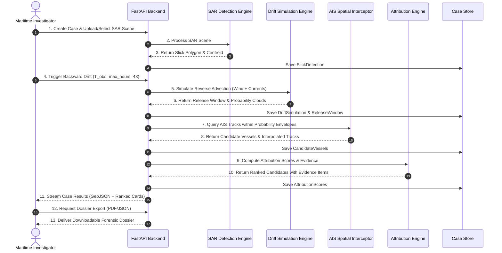

# System Architecture

## Project: Maritime Oil-Spill Attribution Intelligence (SIH26143)

---

## 1. High-Level Architecture Overview

The system is structured into a modern, decoupled **3-Tier Geospatial Analytics & Forensics Architecture**:
1. **Presentation Layer (Frontend):** Modern React / TypeScript single-page application with Leaflet / MapLibre for geospatial visualization, interactive time scrubber, and evidence dossiers.
2. **Application & Orchestration Layer (Backend API):** FastAPI (Python) web framework providing asynchronous endpoints, task orchestration, pipeline execution, and forensic dossier generation.
3. **Core Scientific & Analytics Engines (Domain Core):**
   - **SAR Engine:** Computer Vision & Segmentation for dark-formation detection and feature extraction.
   - **Drift Engine:** Lagrangian Particle Tracking back-advection simulator incorporating hydrodynamic currents and meteorological wind vectors.
   - **AIS & Spatiotemporal Engine:** Spatial indexing (R-Tree / H3 / PostGIS / Geopandas), spline trajectory interpolator, and dark vessel anomaly detector.
   - **Attribution Engine:** Explainable multi-factor Bayesian/heuristic scoring engine.

```
┌─────────────────────────────────────────────────────────────────────────┐
│                        FRONTEND (React + Vite)                          │
│  - Map Canvas (Leaflet/MapLibre)        - Temporal Playback Scrubber    │
│  - Vessel Attribution Leaderboard       - Evidence Dossier & PDF Export │
└────────────────────────────────────┬────────────────────────────────────┘
                                     │ REST / WebSocket (GeoJSON)
┌────────────────────────────────────▼────────────────────────────────────┐
│                    BACKEND API (FastAPI Orchestrator)                   │
│  - Case Management API                  - Pipeline Runner / Workflow    │
│  - Spatial Query Router                 - Dossier Generation Service    │
└──────────┬──────────────────┬───────────────────┬───────────────────┬───┘
           │                  │                   │                   │
┌──────────▼────────┐ ┌───────▼─────────┐ ┌───────▼─────────┐ ┌───────▼─────────┐
│   SAR DETECTION   │ │ DRIFT ENGINE    │ │  AIS SPATIAL    │ │   ATTRIBUTION   │
│      ENGINE       │ │  (Lagrangian)   │ │  INTERCEPTOR    │ │     ENGINE      │
│ - Preprocessing   │ │ - Reverse Euler/│ │ - Spatial Index │ │ - Proximity (35%)│
│ - Dark Patch Seg  │ │   RK4 Advection │ │ - Spline Interp │ │ - Alignment (25%)│
│ - Feature Extr.   │ │ - Prob. Cloud   │ │ - Gap Detection │ │ - Vessel Risk   │
└───────────────────┘ └─────────────────┘ └─────────────────┘ └─────────────────┘
```

---

## 2. Beginner-Friendly Component Breakdown

### 2.1 The Investigation Case Manager
- **What it does:** Think of this as the "digital file folder" for a single spill incident.
- **Why it matters:** An investigator creates a Case with a name, bounding area, and date. Every subsequent piece of evidence (satellite image, slick coordinates, drift simulation, vessel list) is permanently attached to this case ID.

### 2.2 SAR Detection Engine (The "Eye in the Sky")
- **What it does:** Takes a satellite radar image (SAR) and finds the dark, smooth patches on the ocean that indicate oil slicks.
- **How it works:** SAR satellites bounce radar waves off the ocean. Clean water has capillary waves that bounce radar back (bright). Oil dampens waves, creating smooth surfaces that reflect radar away (dark). The engine detects these dark patches, filters out islands/land, measures their size ($\text{km}^2$), and extracts the exact outline (polygon).

### 2.3 Drift Simulation Engine (The "Time Machine")
- **What it does:** Takes the slick location at satellite capture time and calculates backwards in time where that oil originally came from.
- **How it works:** When oil is dumped into the sea, it drifts with ocean currents (100% current speed) and gets pushed by surface wind (~3% of wind speed). By reversing the velocity vectors step-by-step ($-\vec{u}_{\text{current}} - 0.03 \cdot \vec{u}_{\text{wind}}$), we step backwards hour-by-hour to calculate a "Probability Cloud" of where the slick was 6, 12, 24, or 48 hours earlier.

### 2.4 AIS Spatiotemporal Interceptor (The "Ship Tracker")
- **What it does:** Searches through historical ship navigation logs (AIS - Automatic Identification System) to find all vessels that were inside the Probability Cloud during the release time window.
- **How it works:** AIS gives GPS coordinates at intermittent intervals. The engine interpolates the exact vessel positions between pings, checks for "dark gaps" where a captain might have turned off the transponder, and calculates the exact closest point of approach (CPA) to the slick origin.

### 2.5 Multi-Factor Attribution Engine (The "Detective & Judge")
- **What it does:** Takes the candidate ships and scores each one from 0 to 100 on the likelihood of being the culprit.
- **How it works:** Instead of a black box, it uses transparent rules:
  1. *Was the ship right at the center of the probability cloud when the oil was released?* (High points)
  2. *Was the ship traveling in the exact orientation the slick elongated?* (High points)
  3. *Is the ship an oil tanker or bunker vessel vs a small yacht?* (Tankers get higher risk weighting)
  4. *Did the ship slow down or loiter suspiciously?* (High points)
  5. *Did the ship turn off its AIS transponder right around that area?* (Severe penalty score)

### 2.6 Interactive Web Dashboard & Dossier Service
- **What it does:** Gives coast guard and maritime authorities an intuitive web UI.
- **How it works:** Investigators can see an interactive map with the satellite image, the slick, the backwards drift cloud animation, and ship paths. Clicking any ship reveals its full evidence breakdown and generates a formal PDF report.

---

## 3. Data Flow Step-by-Step



---

## 4. Key Architectural Decisions

1. **Deterministic Mock-First Architecture:**  
   Every external dependency (Copernicus SAR API, CMEMS ocean currents, NOAA GFS wind, Live AIS stream) has a **first-class Mock Provider** with deterministic synthetic fixtures. This guarantees fast local development, instant testing, and offline demonstrability for SIH hackathon judging.
2. **GeoJSON as the Universal Data Exchange Format:**  
   All spatial data (slick shapes, drift particle clouds, vessel paths, bounding boxes) are serialized as standard GeoJSON `FeatureCollection` objects, ensuring zero-friction integration between Python spatial libraries and frontend map libraries (Leaflet/MapLibre).
3. **Stateless Core Engines:**  
   The SAR, Drift, AIS, and Attribution engines are pure Python functions/classes with zero internal database state. They take typed inputs and return typed outputs, making them effortlessly testable with `pytest`.
