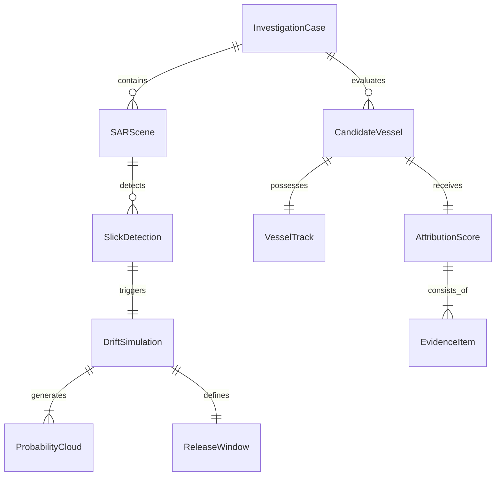

# Data Model Specification

## Project: Maritime Oil-Spill Attribution Intelligence (SIH26143)

---

## 1. Entity-Relationship Overview

---

## 2. Detailed Entity Definitions

### 2.1 `InvestigationCase`
The root aggregate representing a specific maritime spill investigation.
- `id` (string, UUID): Unique case identifier.
- `title` (string): Human-readable name (e.g., *"Malacca Strait Spill Case #2026-08"*).
- `status` (enum: `CREATED`, `SAR_PROCESSED`, `DRIFT_SIMULATED`, `AIS_INTERCEPTED`, `ATTRIBUTION_COMPLETED`, `CLOSED`): Current investigation lifecycle state.
- `region_of_interest` (GeoJSON Polygon): Geographical bounding box for the case.
- `created_at` (datetime): Case creation timestamp.
- `updated_at` (datetime): Last modification timestamp.
- `metadata` (dict): Additional context (investigating agency, analyst name, notes).

### 2.2 `SARScene`
Metadata and raster reference for a Synthetic Aperture Radar satellite pass.
- `id` (string, UUID): Scene identifier.
- `case_id` (string, UUID): Reference to the parent `InvestigationCase`.
- `satellite_platform` (string): e.g., `"Sentinel-1A"`, `"Sentinel-1B"`, `"Synthetic-SAR"`.
- `sensor_mode` (string): e.g., `"IW"` (Interferometric Wide), `"EW"`, `"Stripmap"`.
- `polarization` (string): e.g., `"VV"`, `"VV+VH"`.
- `acquisition_timestamp` ($T_{\text{obs}}$, datetime): Exact UTC timestamp of satellite overpass.
- `footprint_polygon` (GeoJSON Polygon): Satellite image ground footprint.
- `image_path` / `image_url` (string): Path to processed GeoTIFF or preview PNG.
- `pixel_resolution_meters` (float): Spatial resolution (e.g., $10.0$ meters).

### 2.3 `SlickDetection`
A segmented dark formation identified as a probable oil slick.
- `id` (string, UUID): Slick detection identifier.
- `sar_scene_id` (string, UUID): Reference to source `SARScene`.
- `slick_polygon` (GeoJSON Polygon/MultiPolygon): Detailed vector geometry of the slick boundary.
- `centroid` (GeoJSON Point: `[longitude, latitude]`): Center of mass of the slick.
- `area_sq_km` (float): Surface area in square kilometers.
- `perimeter_km` (float): Outer perimeter length in kilometers.
- `major_axis_orientation_deg` (float): Slick orientation angle $[0, 360)$ degrees relative to true North.
- `confidence_score` (float, $0.0 - 1.0$): Classification confidence (oil vs lookalike).
- `lookalike_probability` (float, $0.0 - 1.0$): Assessed probability of being an algae bloom/low wind patch.

### 2.4 `DriftSimulation`
A complete backward Lagrangian advection simulation run.
- `id` (string, UUID): Simulation identifier.
- `slick_detection_id` (string, UUID): Reference to parent `SlickDetection`.
- `simulation_mode` (enum: `BACKWARD_LAGRANGIAN`, `MONTE_CARLO_DIFFUSION`): Drift calculation mode.
- `simulation_start_time` (datetime): $T_{\text{obs}}$ (starting backwards from observation).
- `simulation_end_time` (datetime): $T_{\text{obs}} - \Delta t_{\text{max}}$ (oldest time evaluated).
- `time_step_minutes` (int): Advection integration step (e.g., $15$ or $30$ minutes).
- `particle_count` (int): Number of Monte Carlo particles simulated (e.g., $1000$ - $10000$).
- `wind_leeway_factor` (float): Wind drift fraction (default: $0.03$ or $3\%$).
- `current_advection_factor` (float): Ocean current fraction (default: $1.00$ or $100\%$).
- `created_at` (datetime): Timestamp when simulation was executed.

### 2.5 `ProbabilityCloud`
The spatial dispersion envelope of drift particles at a specific historical time slice.
- `id` (string, UUID): Cloud identifier.
- `drift_simulation_id` (string, UUID): Reference to parent `DriftSimulation`.
- `timestamp` ($T_{\text{step}}$, datetime): Specific historical time of this slice.
- `hours_before_sar` (float): Hours elapsed backward from SAR acquisition (e.g., $6.0, 12.0, 24.0$).
- `envelope_polygon` (GeoJSON Polygon): Convex hull or $95\%$ confidence ellipse bounding the particles.
- `center_point` (GeoJSON Point): Weighted mean center of the particle cloud.
- `dispersion_radius_km` (float): Standard deviation / radius of the spread.
- `particle_sample_points` (list of `[lon, lat]`): Sample particle positions for UI visualization.

### 2.6 `ReleaseWindow`
The estimated temporal interval during which the illicit discharge occurred.
- `id` (string, UUID): Release window identifier.
- `drift_simulation_id` (string, UUID): Reference to parent `DriftSimulation`.
- `estimated_start_time` ($T_{\text{release\_start}}$, datetime): Earliest probable release time.
- `estimated_end_time` ($T_{\text{release\_end}}$, datetime): Latest probable release time.
- `peak_probability_time` ($T_{\text{release\_peak}}$, datetime): Most likely release timestamp.
- `confidence_interval` (float, e.g. $0.90$): Statistical confidence bound.

### 2.7 `VesselTrack`
The time-series GPS navigation trajectory of a single vessel across the investigation period.
- `id` (string, UUID): Track identifier.
- `mmsi` (string): Maritime Mobile Service Identity (9 digits).
- `imo` (string, optional): International Maritime Organization number (7 digits).
- `vessel_name` (string): Name of the vessel.
- `vessel_type` (enum: `TANKER`, `CARGO`, `BUNKER`, `FISHING`, `PASSENGER`, `OTHER`): Vessel category.
- `flag_country` (string): Flag state (e.g., `"Panama"`, `"Liberia"`, `"Marshall Islands"`).
- `waypoints` (list of `VesselWaypoint`):
  - `timestamp` (datetime): Ping time.
  - `longitude` (float), `latitude` (float)
  - `speed_over_ground_knots` (float)
  - `course_over_ground_deg` (float)
  - `navigational_status` (string, e.g. `"Under way using engine"`, `"At anchor"`)
- `has_ais_gaps` (bool): `True` if any transponder gap $> 60$ minutes exists within the ROI.
- `gap_intervals` (list of `[start_datetime, end_datetime]`): Detected transponder dark windows.

### 2.8 `CandidateVessel`
A vessel flagged for potential involvement because its path intersected the release probability cloud.
- `id` (string, UUID): Candidate record identifier.
- `case_id` (string, UUID): Reference to parent `InvestigationCase`.
- `vessel_track_id` (string, UUID): Reference to `VesselTrack`.
- `closest_point_of_approach_km` (float): Minimum distance between ship and drift center at release window.
- `time_of_closest_approach` (datetime): Timestamp when closest approach occurred.
- `interpolated_position_at_cpa` (GeoJSON Point): Exact coordinate at time of closest approach.
- `is_in_release_envelope` (bool): `True` if vessel passed through the $95\%$ probability cloud.

### 2.9 `AttributionScore`
The explainable, composite liability score assigned to a candidate vessel.
- `id` (string, UUID): Score identifier.
- `candidate_vessel_id` (string, UUID): Reference to `CandidateVessel`.
- `total_score` (float, $0.0 - 100.0$): Final aggregated attribution rating.
- `risk_level` (enum: `VERY_HIGH`, `HIGH`, `MEDIUM`, `LOW`, `NEGLIGIBLE`): Categorical risk bracket.
- `sub_scores`:
  - `proximity_score` (float, $0.0 - 35.0$): Based on physical distance to drift origin.
  - `trajectory_alignment_score` (float, $0.0 - 25.0$): Alignment with slick expansion axis.
  - `vessel_type_risk_score` (float, $0.0 - 15.0$): High for crude/chemical tankers and bunker craft.
  - `navigational_anomaly_score` (float, $0.0 - 15.0$): Loitering, speed drops, abrupt course changes.
  - `ais_integrity_penalty` (float, $0.0 - 10.0$): Penalties for transponder gaps in the spill zone.

### 2.10 `EvidenceItem`
A discrete, verifiable factual finding supporting an attribution score.
- `id` (string, UUID): Evidence identifier.
- `attribution_score_id` (string, UUID): Reference to `AttributionScore`.
- `factor_category` (enum: `PROXIMITY`, `ALIGNMENT`, `VESSEL_TYPE`, `BEHAVIOR`, `AIS_INTEGRITY`): Factor name.
- `title` (string): Brief statement (e.g., *"Vessel turned off AIS for 3.5 hours near drift origin"*).
- `description` (string): Detailed explanation with exact metrics and timestamps.
- `score_impact` (float): Points contributed to the total score.
- `verifiable_data` (dict): Raw supporting numbers (e.g., `{"distance_km": 0.42, "time_diff_minutes": 12}`).
