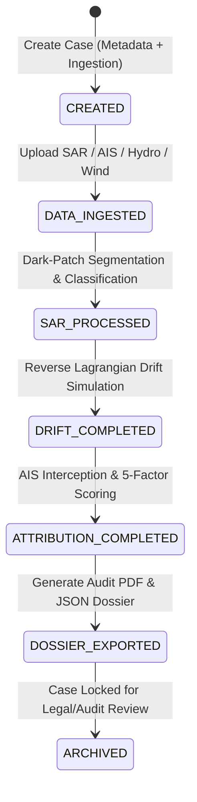

# Product Architecture

**System:** Maritime Oil-Spill Attribution Intelligence  
**Subtitle:** Maritime Environmental Intelligence & Forensic Decision Support  
**Document Reference:** `docs/PRODUCT_ARCHITECTURE.md`  
**Classification:** Enterprise Forensic Technical Architecture  

---

## 1. Product Modules

The platform is designed around six decoupled, single-responsibility operational subsystems:

```
┌─────────────────────────────────────────────────────────────────────────────────────────────┐
│                                   ENTERPRISE APPLICATION SHELL                             │
│                                  (React 18 / TypeScript / Vite)                             │
└──────────────────────────────────────────────┬──────────────────────────────────────────────┘
                                               │ HTTP / REST & WebSockets
┌──────────────────────────────────────────────▼──────────────────────────────────────────────┐
│                                    FASTAPI BACKEND GATEWAY                                  │
│                            (Request Validation, Auth, Case Dispatch)                        │
└──────┬───────────────────────┬──────────────────────┬───────────────────────┬───────────────┘
       │                       │                      │                       │
┌──────▼────────┐       ┌──────▼────────┐      ┌──────▼────────┐       ┌──────▼────────┐
│  MODULE 1:    │       │  MODULE 2:    │      │  MODULE 3:    │       │  MODULE 4:    │
│  SAR SENSING  │       │ HYDRODYNAMIC  │      │ AIS VESSEL    │       │ MULTI-FACTOR  │
│  & DETECTION  │──────▶│ LAGRANGIAN    │─────▶│ INTERCEPTION  │──────▶│ ATTRIBUTION   │
│  (CFAR/Otsu/  │       │ DRIFT ENGINE  │      │ & TRAJECTORY  │       │ & SCORING     │
│   Morphology) │       │ (Monte Carlo) │      │ INTERPOLATION │       │ ENGINE        │
└───────────────┘       └───────────────┘      └───────────────┘       └──────┬────────┘
                                                                              │
                                                                       ┌──────▼────────┐
                                                                       │  MODULE 5:    │
                                                                       │  FORENSIC     │
                                                                       │  DOSSIER &    │
                                                                       │  AUDIT EXPORT │
                                                                       └───────────────┘
```

1. **SAR Ingestion & Slick Detection (`sar_detector.py`):**
   Ingests calibrated Copernicus Sentinel-1 Level-1 GRD imagery, strips speckle noise via spatial filtering, executes Constant False Alarm Rate (CFAR) adaptive thresholding and morphological segmentation, classifies dark ocean patches against low-wind calm zones and biogenic lookalikes, and outputs verified GeoJSON slick boundary polygons with geometric metrics (area, perimeter, orientation).

2. **Hydrodynamic Drift Simulation (`drift_engine.py`):**
   Executes backward Lagrangian particle back-tracking combining CMEMS ocean currents and ECMWF ERA5 10m surface winds with stochastic Monte Carlo turbulent diffusion ($K_h \approx 2.5\text{ m}^2/\text{s}$). Reconstructs origin centroid dispersion envelopes and calculates the historical release window interval $[T_{\text{start}}, T_{\text{end}}]$.

3. **AIS Spatiotemporal Trajectory Interception (`ais_engine.py`):**
   Queries historical vessel traffic databases against the spatiotemporal release cloud. Performs cubic/linear spline waypoint interpolation, evaluates Closest Point of Approach (CPA), calculates distance-to-origin at discharge time, and flags transponder anomalies (dark gaps, speed reductions, erratic course alterations).

4. **Multi-Factor Attribution Engine (`scoring_engine.py`):**
   Computes a deterministic, explainable composite attribution score $S_{\text{attr}} \in [0, 100]$ across 5 weighted forensic factors:
   - Spatiotemporal Proximity ($w_1 = 0.35$)
   - Trajectory Drift Alignment ($w_2 = 0.25$)
   - Vessel Risk & Cargo Profile ($w_3 = 0.15$)
   - Navigational Anomaly ($w_4 = 0.15$)
   - AIS Transponder Integrity ($w_5 = 0.10$)

5. **Forensic Evidence & Dossier Compilation (`report_generator.py`):**
   Assembles the chain of custody into structured evidence items (SUPPORTING, CONTRADICTING, EXCULPATORY, DATA QUALITY, UNCERTAINTY). Generates audit-grade PDF reports with cryptographic SHA-256 bundle verification.

---

## 2. Application Shell

The user interface delivers a mission-critical, enterprise command environment:
- **Unified Navigation Header (`AppShell.tsx`):**
  Provides global status telemetry, persistent case selection, quick action for new case provisioning, and live health monitoring.
- **Geospatial Workspace (`InvestigationMap.tsx`):**
  Dual-mode Leaflet map rendering SAR radar footprint, detected slick polygon, Monte Carlo probability cloud envelopes, and historical AIS vessel tracks with rank-based coloring. Includes four-category provenance legends (`OBSERVED`, `MODEL-DERIVED`, `ASSUMPTION`, `UNCERTAINTY`).
- **Synchronized Continuous Timeline (`SynchronizedTimeline.tsx`):**
  Microsecond-accurate time scrubber synchronizing particle swarm dispersion and vessel track motion from satellite observation time $T_{\text{obs}}$ back to estimated discharge time $T_{\text{release}}$.
- **Leaderboard & Evidence Inspection (`CandidateRanking.tsx`, `EvidencePanel.tsx`):**
  Rank-ordered candidate vessel cards, risk badges, sub-score radar charts, and transparent evidence lists with zero legal accusation language.
- **Workflow State Management:**
  Reactive UI displaying real pipeline states (`CREATED`, `SAR_PROCESSED`, `DRIFT_COMPLETED`, `ATTRIBUTION_COMPLETED`), eliminating artificial demo controls or fake progress timers.

---

## 3. Investigation Architecture

Investigations follow an immutable, auditable entity lifecycle:



Each investigation case contains:
- `id`: Unique identifier (`case_{slug}_{date}_{hash}`)
- `title`: Formal investigation title
- `status`: Strongly-typed `CaseStatus` enum
- `region_of_interest`: Geographic bounding polygon
- `metadata`: Sensor platforms, timestamps, lineage hashes, data classification (`HISTORICAL_OBSERVED_DATA` vs. `SYNTHETIC_BENCHMARK_DATA`)
- `artifacts`: Persisted JSON and binary artifacts stored in dedicated case directories (`data/cases/<case_id>/`)

---

## 4. Live Data Architecture

The enterprise system supports dual operational modes:

1. **Historical Forensic Mode (Primary):**
   - Ingestion of archived Sentinel-1 Level-1 GRD SAR imagery from Copernicus Data Space Ecosystem (CDSE).
   - Ingestion of historical AIS vessel position logs (terrestrial receiver networks and satellite feeds).
   - Ingestion of Copernicus Marine Service (CMEMS GLORYS12V1) reanalysis surface currents.
   - Ingestion of ECMWF ERA5 atmospheric reanalysis 10m surface winds.

2. **Operational Near-Real-Time Mode (NRT Ingestion Architecture):**
   - Ingestion connector for live Copernicus OGC WMS/WCS and SAFE package downloads.
   - Streaming AIS transponder connectors (AISHub / Spire / MarineTraffic REST & WebSocket feeds).
   - Global Forecast System (GFS) 0.25° atmospheric wind forecasts and NOAA RTOFS / HYCOM ocean current models.
   - Strict data validation pipeline: checks coordinate boundaries, timestamp UTC normalization, CRS reprojection (WGS84 EPSG:4326), and schema conformance before storing in case repositories.

---

## 5. Provider Architecture

To maintain strict modularity and prevent vendor lock-in, data access is decoupled via abstract base provider interfaces (`backend/app/providers/base.py`):

```python
class SARDataProvider(ABC):
    @abstractmethod
    def search_scenes(self, query: SARQuery) -> List[SARScene]: ...
    @abstractmethod
    def fetch_raster(self, scene: SARScene) -> SARRaster: ...

class AISDataProvider(ABC):
    @abstractmethod
    def query_vessels(self, bbox: BoundingBox, time_window: Tuple[datetime, datetime]) -> List[VesselTrack]: ...

class OceanDataProvider(ABC):
    @abstractmethod
    def get_current_vectors(self, bbox: BoundingBox, timestamp: datetime) -> OceanCurrentGrid: ...

class WindDataProvider(ABC):
    @abstractmethod
    def get_wind_vectors(self, bbox: BoundingBox, timestamp: datetime) -> WindGrid: ...
```

### Provider Availability & No Silent Fallbacks
- **Production Safety:** Production mode must never silently substitute fake or synthetic data when a real provider or uploaded file is unavailable.
- **Explicit Availability Status:** If a data provider is missing, the system emits an unambiguous `Data source unavailable: [source details]` error and records the unavailable state in provenance metadata.
- **Testing Isolation:** Synthetic generators (`SyntheticSARGenerator`, synthetic AIS fixtures) are strictly constrained to automated test suites and benchmark scenarios.

---

## 6. Scientific Pipeline

The pipeline orchestrator (`pipeline_service.py`) coordinates execution across all engines with deterministic reproducibility:

1. **SAR Preprocessing & Dark-Patch CFAR Segmentation:**
   $$I_{\text{clean}} = \text{LeeFilter}(I_{\text{raw}}, \text{window}=7)$$
   Adaptive threshold:
   $$T_{\text{CFAR}} = \mu_{\text{background}} - k \cdot \sigma_{\text{background}}$$
   Regions below $T_{\text{CFAR}}$ are clustered into candidate slick polygons.
2. **Oil vs. Lookalike Rejection:**
   Evaluates perimeter-to-area complexity, ambient wind speed ($2\text{ m/s} \le W \le 12\text{ m/s}$), backscatter contrast ($\Delta\text{dB} \ge 4.5\text{ dB}$), and proximity to coastal landmasses.
3. **Lagrangian Advection Simulation:**
   Governing particle advection equation:
   $$\vec{x}(t - \Delta t) = \vec{x}(t) - \left[ \vec{u}_{\text{current}} + \alpha \vec{u}_{\text{wind}} + \vec{u}_{\text{turb}} \right] \Delta t$$
   where $\alpha = 0.030$, and $\vec{u}_{\text{turb}}$ is sampled from a Gaussian diffusion model scaled by diffusivity $K_h$.
4. **Origin & Release Window Estimation:**
   Origin centroid $\vec{C}_{\text{origin}}$ and dispersion radius $R_{\text{disp}}$ are calculated from particle swarm spatial distribution at $T_{\text{release}}$.
5. **AIS Interception & Attribution Matrix:**
   Interpolates candidate positions $\vec{P}_{\text{vessel}}(t)$ and computes:
   $$S_{\text{attr}} = w_1 S_{\text{prox}} + w_2 S_{\text{align}} + w_3 S_{\text{type}} + w_4 S_{\text{anom}} + w_5 S_{\text{ais}}$$

---

## 7. Persistence Architecture

The persistence layer (`persistence_service.py`, `case_service.py`) follows a durable, multi-tier storage pattern:

- **Case Root (`data/cases/<case_id>/`):**
  - `case.json`: Metadata, region of interest, lifecycle status.
  - `sar_scene.json`: Satellite platform metadata, footprint geometry.
  - `slick_detection.json`: Segmented polygon geometry, area, perimeter, confidence.
  - `vessels.json`: Full historical waypoints and track attributes for candidate vessels.
  - `environment.json`: Hydrodynamic and meteorological vector grids.
  - `investigation_result.json`: Complete computed pipeline outputs (probability clouds, scores, candidate vessels).
  - `provenance.json`: Lineage log recording timestamps, engine versions, parameter options, and SHA-256 checksums.
  - `reports/`: Audit PDF reports generated by WeasyPrint/ReportLab.
- **Database Storage (Production Option):**
  - Compatible with SQLite (local deployment) and PostgreSQL / PostGIS (enterprise deployment) via SQLAlchemy schemas.

---

## 8. Authentication Architecture

For enterprise multi-analyst environments:
- **Identity Provider (IdP) Integration:**
  Authentication is handled via OAuth2 / OpenID Connect (OIDC) supporting enterprise SSO (Azure AD, Keycloak, Okta).
- **Session Tokens:**
  Short-lived JWT access tokens (15-minute expiration) paired with secure, HTTP-only refresh tokens.
- **API Security:**
  Service-to-service communication authenticated via API Keys (`X-API-Key`) with rotation policies.

---

## 9. Authorization Architecture (RBAC)

Role-Based Access Control regulates actions based on user responsibilities:

| Role | Permissions |
|------|-------------|
| **Auditor / Observer** | View published cases, inspect evidence dossiers, download audit PDFs. Cannot create cases or run pipelines. |
| **Investigator** | Create new investigation cases, upload sensor data, configure simulation parameters, execute pipelines. |
| **Forensic Lead** | Full investigator permissions + approve official attribution reports, sign evidentiary dossiers, lock cases. |
| **System Administrator** | Manage system settings, configure data provider connections, manage user accounts and API keys. |

---

## 10. Observability Architecture

- **Structured Logging:**
  Python `structlog` / `logging` emitting JSON-formatted log records containing `timestamp_utc`, `case_id`, `subsystem`, `level`, and `trace_id`.
- **Metrics Collection:**
  Prometheus metrics exporter monitoring:
  - Pipeline duration by module (SAR detection, drift simulation, AIS scoring).
  - Memory allocation and particle simulation throughput.
  - API endpoint response latency and status code distributions.
- **Health Probes:**
  - Liveness probe: `/health/live` (confirms process viability).
  - Readiness probe: `/health/ready` (confirms database connectivity and loaded case availability).

---

## 11. Reporting Architecture

- **Format:** Formal multi-page forensic dossier generated in PDF/A (archival) format and JSON audit bundle.
- **Forensic Tone:** Strict adherence to non-accusatory language standards:
  > *"This vessel is the highest-ranked candidate based on the available spatial, temporal, and navigational evidence."*
- **Tamper Evidence:** Every generated dossier includes a cryptographic SHA-256 hash calculated over the input sensor datasets, drift parameters, and candidate score records.
- **Provenance Attribution:** Every evidence item explicitly categorizes the source: `OBSERVED`, `MODEL-DERIVED`, `ASSUMPTION`, or `UNCERTAINTY`.

---

## 12. Deployment Architecture

- **Containerization:**
  Multi-stage Docker builds for backend (Python 3.10-slim with GEOS/GDAL geospatial dependencies) and frontend (Node 20 Alpine builder, Nginx alpine runtime).
- **Orchestration:**
  `docker-compose.yml` for local standalone workstations; Kubernetes Helm charts for cloud/enterprise high-availability clusters.
- **Resource Sizing:**
  - Minimum: 4 vCPU, 8 GB RAM, 20 GB persistent disk.
  - Recommended (Enterprise): 8 vCPU, 16 GB RAM, 100 GB NVMe storage (for SAR raster caching and large AIS datasets).
- **Air-Gapped & Maritime Edge Compatibility:**
  The platform functions fully in offline / air-gapped environments using local NetCDF and CSV datasets with zero mandatory cloud dependencies.
